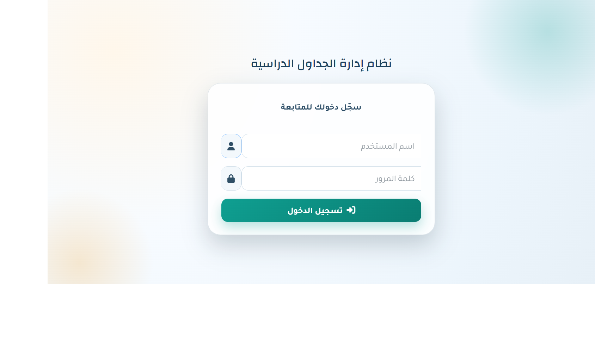
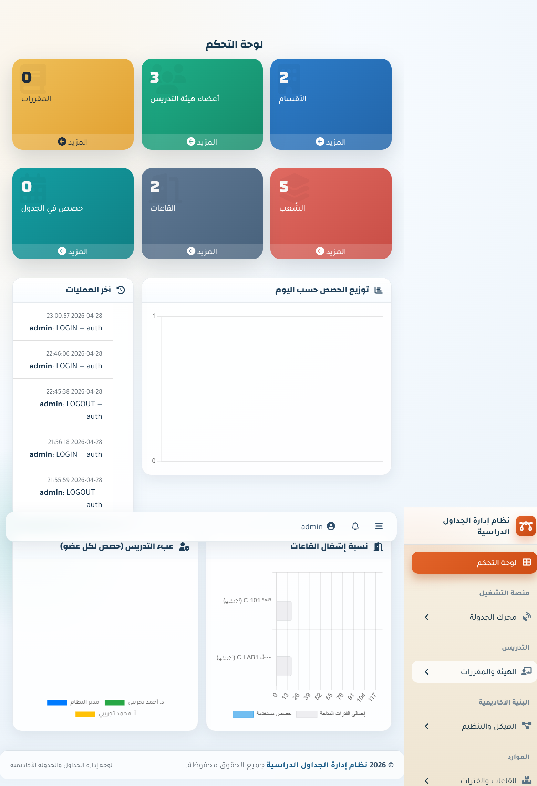
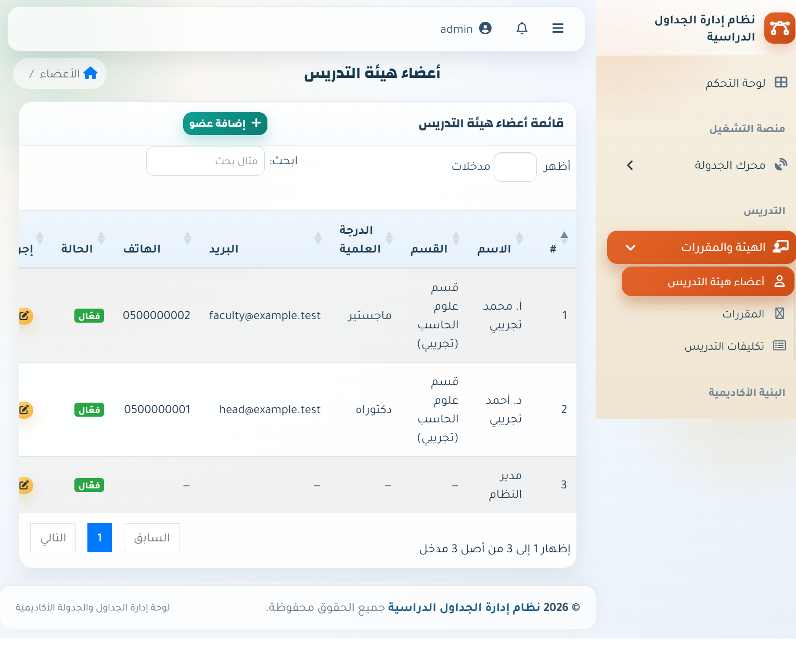
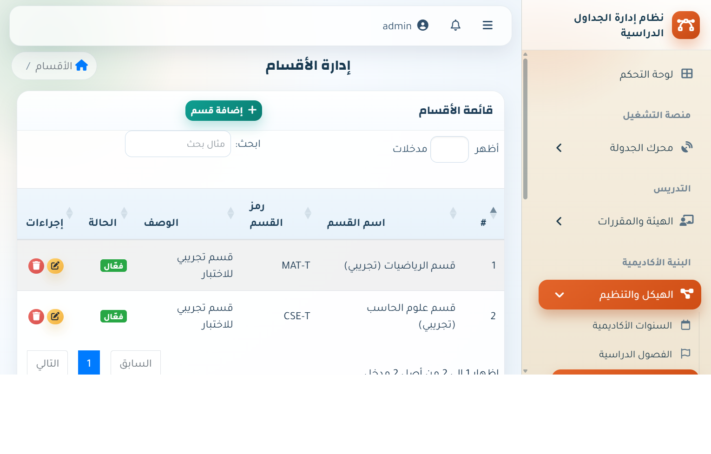

# Timetable Management System

## Table of Contents

- [Overview](#overview)
- [Key Features](#key-features)
- [Tech Stack](#tech-stack)
- [Project Structure](#project-structure)
- [Local Setup](#local-setup)
- [Screenshots](#screenshots)
- [Main Modules](#main-modules)
- [Typical Workflow](#typical-workflow)
- [API Summary](#api-summary)
- [Important Notes](#important-notes)
- [Documentation](#documentation)

## Overview

This project is a university timetable management system built with PHP and MySQL. It supports academic administration from master data setup to teaching assignments, scheduling, timetable review, exports, notifications, and backup workflows.

The repository currently includes:

- A PHP 8 MVC-style application in `app/`, `core/`, `config/`, and `public/`
- A legacy procedural implementation in `_legacy/` kept for reference and compatibility work

The active web entry point is `public/index.php`.

## Key Features

- Login and protected staff workflows
- Department, level, division/section, and subject management
- Faculty member and user management
- Classroom and session management
- Member-course assignment
- Timetable scheduling with conflict prevention
- Priority-based scheduling controls
- Timetable listing and export
- Audit logs, notifications, and system settings
- Data transfer, backups, and cloud sync tools
- API endpoints for timetable-related data

## Tech Stack

- PHP 8.0+
- MySQL or MariaDB
- Custom core framework and router
- MySQLi-based database layer
- XAMPP, Apache, or any compatible PHP hosting environment

## Project Structure

```text
app/            Controllers, models, services, views
config/         App config, database config, routes, permissions, cloud settings
core/           Bootstrap, router, request, session, database, view classes
database/       Migrations, seeds, legacy migration helper
docs/           Arabic technical documentation and migration notes
public/         Front controller and install wizard
storage/        Backups, exports, logs, cache, rate-limit data
_legacy/        Older procedural version
```

## Local Setup

1. Put the project in your local web root, for example `c:/xampp/htdocs/timetable`.
2. Start Apache and MySQL.
3. Make sure PHP 8.0 or newer is available.
4. Open the installer:

   `http://localhost/timetable/public/install.php`

5. Complete the install steps:
   - Check requirements
   - Configure the database
   - Run migrations and seeds
   - Create the admin account
   - Save system settings
6. Sign in from:

   `http://localhost/timetable/public/login`

## Screenshots

The following screenshots were captured from a working local environment.

### Login



### Dashboard



### Members



### Departments



## Main Modules

- Authentication: login, logout, profile, protected routes
- Dashboard: system landing page after sign-in
- Departments: academic department management
- Levels: academic year or level management
- Divisions and Sections: organizational teaching groups
- Members: faculty member records
- Subjects: course definitions by department and level
- Classrooms: teaching room management
- Sessions: time-slot management
- Member Courses: assignment of subjects to faculty members and sections
- Scheduling: timetable placement with conflict checks
- Priority: controlled scheduling order and exceptions
- Timetable: final timetable view and export
- Users: application user accounts
- Audit Logs: administrative traceability
- Notifications: in-app messaging workflows
- Settings and Data Transfer: configuration, import, export, sample files
- Backups and Cloud Sync: local backup plus cloud integrations

## Typical Workflow

1. Install the system.
2. Sign in as the administrator.
3. Create departments, levels, divisions or sections, subjects, classrooms, and sessions.
4. Add faculty members and user accounts.
5. Assign member courses.
6. Configure priority scheduling if your process requires it.
7. Schedule timetable entries.
8. Review or export the final timetable.

## API Summary

Public authentication route:

- `POST /api/auth/login`

Authenticated API routes:

- `GET /api/timetable`
- `GET /api/departments`
- `GET /api/members`
- `GET /api/classrooms`
- `GET /api/subjects`
- `GET /api/sections`
- `GET /api/sessions`

Authenticated API requests require a Bearer token.

## Important Notes

- Database settings are written by the installer into `config/database.php`.
- Features such as backups, logs, exports, and rate limiting depend on writable paths under `storage/`.
- Cloud integrations are configured through `config/cloud.php`.
- The repository contains compatibility and migration-related paths while moving away from the legacy structure.

## Documentation

- `README.ar.md`
- `docs/complete-site-documentation-ar.md`
- `docs/site-blueprint-ar.md`
- `docs/url-compatibility-map.md`