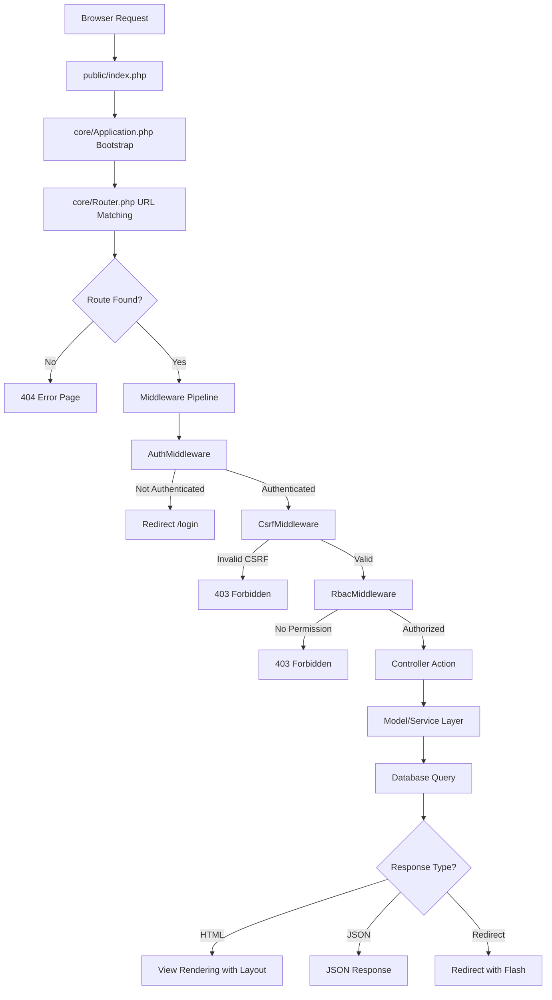
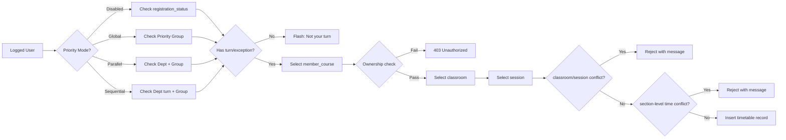
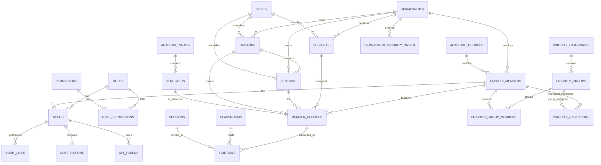

# Blueprint - مخطط النظام

## 1) Architecture Blueprint

النظام يتبع نمط MVC مخصص:
- إطار MVC كامل (Router, Controller, Model, View, Request, Session, Database).
- سلسلة Middleware (Auth, CSRF, RBAC, API Auth, API Role, Rate Limiting).
- طبقة خدمات (Services) للمنطق التجاري.
- طبقة بيانات MySQL عبر MySQLi مع Prepared Statements.
- واجهة AdminLTE 3 مع دعم RTL.

## 2) Request Flow Blueprint



## 3) API Request Flow Blueprint

```mermaid
flowchart TD
    A[API Request] --> B[public/index.php]
    B --> C[core/Router.php]
    C --> D[RateLimitMiddleware]
    D -->|Rate Exceeded| E[429 Too Many Requests]
    D -->|OK| F{Auth Required?}
    F -->|Login Route| G[AuthController@login]
    F -->|Yes| H[ApiAuthMiddleware]
    H -->|Invalid Token| I[401 Unauthenticated]
    H -->|Valid| J{Admin Route?}
    J -->|No| K[Student/Lookup Controller]
    J -->|Yes| L[ApiRoleMiddleware]
    L -->|Not Admin| M[403 Forbidden]
    L -->|Authorized| N[AdminController]
    K & N --> O[JSON Response with Contract]
```

## 4) Scheduling Workflow Blueprint



## 5) Data Relationship Blueprint (ER)



## 6) Module Blueprint

### الإطار الأساسي
- `public/index.php` — Front Controller
- `core/Application.php` — Bootstrap + Dispatch
- `core/Router.php` — URL Matching + Route Groups
- `core/Controller.php` — Base Controller
- `core/Model.php` — Base ORM Model
- `core/Database.php` — MySQLi Wrapper
- `core/Request.php` — HTTP Request Abstraction
- `core/Session.php` — Session + Flash Messages
- `core/View.php` — Template Engine

### Middleware
- `AuthMiddleware` — Session Authentication
- `CsrfMiddleware` — CSRF Token Validation
- `RbacMiddleware` — Permission Check
- `ApiAuthMiddleware` — Bearer Token Auth
- `ApiRoleMiddleware` — Admin Role Check
- `RateLimitMiddleware` — Request Rate Limiting

### المتحكمات (24 Web + 7 API)
- Auth: `AuthController`
- Home: `HomeController`
- Dashboard: `DashboardController`
- CRUD Resources: `DepartmentController`, `LevelController`, `MemberController`, `SubjectController`, `DivisionController`, `SectionController`, `ClassroomController`, `SessionController`, `MemberCourseController`
- Scheduling: `SchedulingController`
- Priority: `PriorityController`
- Timetable: `TimetableController`
- Reports: `ReportsController`
- Academic: `AcademicYearController`, `SemesterController`
- Admin: `UserController`, `AuditLogController`, `NotificationController`, `SettingController`, `DataTransferController`, `BackupController`
- API Legacy: `Api\AuthController`, `Api\TimetableController`
- API v1: `Api\V1\BaseApiController`, `Api\V1\AuthController`, `Api\V1\StudentController`, `Api\V1\LookupController`, `Api\V1\AdminController`

### الخدمات
- `PriorityService` — منطق الأولوية والأدوار
- `SchedulingService` — كشف التعارضات
- `ExportService` — تصدير PDF/Excel
- `BackupService` — النسخ الاحتياطي المحلي
- `DataTransferService` — استيراد وتصدير البيانات
- `AuditService` — سجل التدقيق
- `NotificationService` — الإشعارات
- `Cloud/GoogleDriveService` — تكامل Google Drive
- `Cloud/SupabaseService` — تكامل Supabase
- `Cloud/FirebaseService` — تكامل Firebase

### النماذج (22 نموذج)
- `User`, `Role`, `Department`, `Level`, `AcademicDegree`, `Member`, `Subject`, `Division`, `Section`, `Classroom`, `Session`, `MemberCourse`, `Timetable`, `AcademicYear`, `Semester`, `AuditLog`, `Notification`, `Setting`, `PriorityCategory`, `PriorityGroup`, `PriorityGroupMember`, `PriorityException`, `DepartmentPriorityOrder`

## 7) Security Blueprint

- **AuthMiddleware**: حماية المسارات المصادق عليها.
- **CsrfMiddleware**: تأمين POST/PUT/DELETE.
- **RbacMiddleware**: فحص الصلاحيات قبل تنفيذ المتحكم.
- **ApiAuthMiddleware**: مصادقة Bearer Token.
- **ApiRoleMiddleware**: فحص أدوار الإدارة.
- **RateLimitMiddleware**: تحديد معدل الطلبات.
- **Ownership Guard**: حماية تعديل/حذف سجلات التسكين.
- **Input Validation**: عبر `core/Request.php`.
- **Prepared Statements**: في جميع عمليات قاعدة البيانات.

## 8) Compatibility Blueprint

- توجد ملفات توافق في `core/` (auth.php, bootstrap.php, csrf.php, flash.php).
- مرجع التحويل في [docs/url-compatibility-map.md](url-compatibility-map.md).
- الكود القديم محفوظ في `_legacy/` كمرجع.

## 9) Deployment Blueprint (Local XAMPP)

1. Apache + MySQL ON.
2. فتح `http://localhost/timetable/install.php` لأول مرة.
3. تشغيل الترحيلات وإنشاء الجداول (35 migration).
4. إنشاء حساب المدير.
5. تسجيل الدخول والبدء.

## 10) Operational Checks Blueprint

- Check 1: إنشاء قسم/مستوى/شعبة/سكشن/مادة.
- Check 2: إنشاء عضو + user مربوط بدور.
- Check 3: إنشاء member_course (تكليف تدريس).
- Check 4: إعداد نظام الأولوية (تصنيف + مجموعة + أعضاء).
- Check 5: تسكين صحيح مع احترام الأولوية.
- Check 6: محاولة تعارض (يجب أن يرفض).
- Check 7: تعديل/حذف من غير مالك (يجب أن يرفض).
- Check 8: تقدم المجموعة/القسم في نظام الأولوية.
- Check 9: عرض الجدول النهائي مع فلترة AJAX.
- Check 10: تصدير الجدول.
- Check 11: إنشاء نسخة احتياطية ورفعها للسحابة.
- Check 12: اختبار API v1 (login → me → student timetable).
