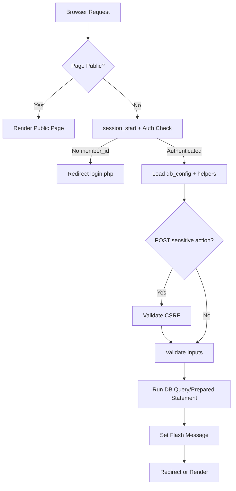
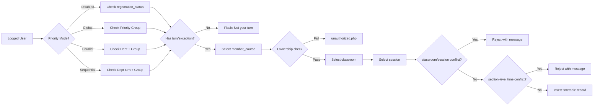
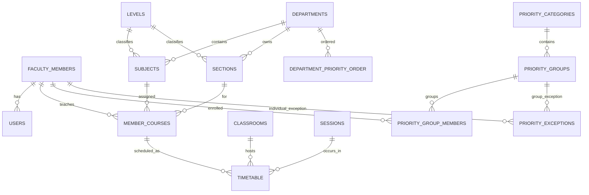

# Blueprint - مخطط النظام

## 1) Architecture Blueprint

النظام يتبع نمط Monolith بسيط:
- واجهة صفحات PHP إجرائية.
- طبقة مساعدة Core (Auth, CSRF, Flash, Bootstrap).
- طبقة بيانات MySQL عبر MySQLi.

## 2) Request Flow Blueprint

## 3) Scheduling Workflow Blueprint

## 4) Data Relationship Blueprint (ER Simplified)

## 5) Module Blueprint

- Setup & Access:
  - [install.php](../install.php)
  - [login.php](../login.php)
  - [logout.php](../logout.php)
- Core:
  - [core/bootstrap.php](../core/bootstrap.php)
  - [core/auth.php](../core/auth.php)
  - [core/csrf.php](../core/csrf.php)
  - [core/flash.php](../core/flash.php)
- Domain CRUD:
  - departments/levels/sections/subjects/classrooms/sessions/members/membercourses
- Priority Management:
  - priority/categories, priority/groups, priority/exceptions, priority/dept-order
- Scheduling:
  - [scheduling.php](../scheduling.php)
  - [edit_scheduling.php](../edit_scheduling.php)
  - [delete_scheduling.php](../delete_scheduling.php)
- Query/Output:
  - [table_query.php](../table_query.php)

## 6) Security Blueprint

- Session guard: منع الوصول بدون session.
- CSRF guard: تأمين POST الحساسة.
- Ownership guard: حماية تعديل/حذف سجلات التسكين.
- Input guard: فحص المعرفات والحقول المطلوبة.
- DB guard: Prepared statements حيثما تم تحديث المسارات.

## 7) Compatibility Blueprint

- توجد مسارات canonical جديدة مع wrappers قديمة.
- مرجع التحويل في [docs/url-compatibility-map.md](url-compatibility-map.md).
- الهدف المرحلي: الاحتفاظ بالتوافق ثم إزالة تدريجية بعد ثبات الاستخدام.

## 8) Deployment Blueprint (Local XAMPP)

1. Apache + MySQL ON.
2. فتح [install.php](../install.php) لأول مرة.
3. إنشاء db_config والجداول.
4. تسجيل دخول المدير.
5. تشغيل الوحدات حسب ترتيب الإدخال.

## 9) Operational Checks Blueprint

- Check 1: إنشاء قسم/فرقة/سكشن/مادة.
- Check 2: إنشاء عضو + user مربوط.
- Check 3: إنشاء member_course.
- Check 4: تسكين صحيح.
- Check 5: محاولة تعارض (يجب أن يرفض).
- Check 6: تعديل/حذف من غير مالك (يجب أن يرفض).
- Check 7: عرض الجدول النهائي.
